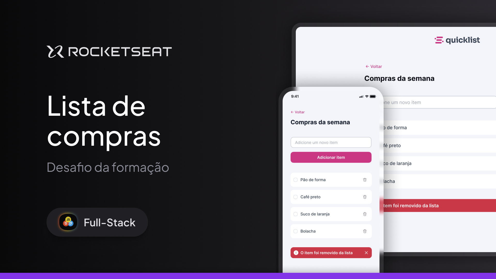

📋 Lista de Compras – Projeto Web

Este projeto é uma aplicação web simples de Lista de Compras, desenvolvida com o objetivo de praticar e consolidar conhecimentos em HTML, CSS e JavaScript.

A aplicação permite ao usuário adicionar, visualizar e organizar itens de forma prática e intuitiva, simulando uma lista de compras do dia a dia. O foco do projeto foi trabalhar a manipulação do DOM, eventos em JavaScript e a estruturação de uma interface limpa e responsiva.

🚀 Tecnologias Utilizadas

HTML5 – Estrutura da aplicação

CSS3 – Estilização e layout

JavaScript – Lógica, interatividade e manipulação dos elementos

🎯 Objetivo do Projeto

Este projeto foi criado como parte do meu aprendizado em Desenvolvimento Web Full Stack, servindo como prática dos conceitos fundamentais do front-end e como base para projetos mais complexos no futuro.

📸 Demonstração

Uma imagem da aplicação está disponível neste repositório para visualização do layout e funcionamento.

